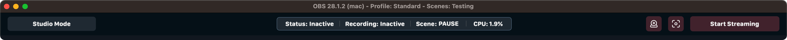
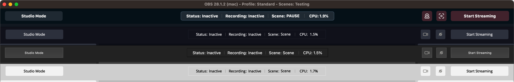

# OBS Toolbar

### This plugin makes it easy to access common OBS controls in a toolbar-like widget, without the need of the OBS Controls Dock!

&nbsp;
*****

&nbsp;
## Features
- Stream, Record, Studio Mode, & Virtual Camera buttons.
- Undockable, with top or bottom window placement.
- Status display, with stream status, recording status, active scene, and CPU usage.
- Tested on both macOS Monterey & Windows 11 with OBS 28.1.2.
- **OBS Themeing Compatible!**

&nbsp;

&nbsp;
*****

&nbsp;
## Limitations
- Minimum window width of 960px
- Icons are preserved when switching between themes
- Cannot add a settings or virtual cam configuration button at this time

